# STM32F407 UART Bootloader

Bare-metal two-stage boot for the STM32F407VET6 (DevEBox "F4VE" board).  
Register-level, no HAL, no vendor SDK.


## Boot Flow


## Status

- [x] Phase 1: Application at 0x08010000, VTOR relocated
- [x] Phase 2: Bootloader with jump-to-application (SP + vector handoff)
- [x] Phase 3a: Button-triggered mode select (K0/PA0 within timeout window)
- [x] Phase 3b: UART driver — USART1 PA9/PA10, 115200-8N1, bare-metal register config
- [x] Phase 4: Flash self-programming (unlock, sector erase, word program, verify)
- [x] Phase 5: Framed protocol + Python host flasher (PING, ERASE, WRITE, VERIFY, JUMP)
- [x] Phase 6: Software-triggered reprogram — SRAM magic + NVIC_SystemReset, no button needed if an app is running
- [x] Phase 7: Non-blocking repeating "BOOT> Ready" announce — flasher script can be started before or after entering update mode
- [ ] Phase 8: File restructure (uart.c, flash.c, protocol.c)
- [ ] Phase 9 (stretch): CAN transport, AES-128 encryption, ECDSA image signature

## Protocol

Custom binary framing over UART:

```
[SYNC 0x7F] [CMD] [LEN_H] [LEN_L] [PAYLOAD...] [CRC32]
```

| Command | Code | Payload | Response |
|---------|------|---------|----------|
| PING    | 0x01 | none | ACK (0x79) |
| ERASE   | 0x02 | none (sectors 4–7 hardcoded) | ACK |
| WRITE   | 0x03 | 4-byte addr + up to 1020 data | ACK |
| VERIFY  | 0x04 | 4-byte addr + 4-byte length | ACK + CRC32 |
| JUMP    | 0x05 | none | ACK → app launches |

- CRC32 over CMD+LEN+PAYLOAD (standard polynomial 0xEDB88320)
- Address fencing: WRITE/VERIFY reject addresses outside 0x08010000–0x0807FFFF
- Bootloader sectors (0–3) are never erased or written — hardcoded protection
- NACK (0x1F) + error code returned on failure
- Max payload is 1024 bytes total (bootloader's `rx_buff` size). WRITE reserves
  4 of those bytes for the address, so the host chunks firmware data at 1020
  bytes per chunk to stay under the limit.

### Error Codes

| Code | Meaning |
|------|---------|
| 0x01 | Payload too large (>1024 bytes) |
| 0x02 | CRC mismatch |
| 0x03 | Payload too short for WRITE |
| 0x04 | Address out of range |
| 0x05 | Invalid VERIFY payload length |
| 0x06 | No valid app (JUMP rejected) |
| 0xFF | Unknown command |

## Flash Memory Map

```
Sector 0:  0x08000000  16KB  ┐
Sector 1:  0x08004000  16KB  │ Bootloader (64KB)
Sector 2:  0x08008000  16KB  │ Protected — never erased by protocol
Sector 3:  0x0800C000  16KB  ┘
────────────────────────────────
Sector 4:  0x08010000  64KB  ┐
Sector 5:  0x08020000  128KB │ Application (448KB)
Sector 6:  0x08040000  128KB │ Erased + programmed via UART
Sector 7:  0x08060000  128KB ┘
```

## SRAM Layout

The top 16 bytes of SRAM are reserved (both linker scripts set
`RAM LENGTH = 128K-16` and `_estack = 0x20020000-16`) so the stack can never
grow into the software-reset magic value:

```
0x20020000  ┬─ physical top of SRAM
0x2001FFF0  │  MAGIC_ADDR — reserved, outside stack's reach
            ├─ _estack (stack starts here, grows downward)
            ↓
0x20000000  ┴─ bottom of SRAM (.data / .bss / heap)
```

## Boot Flow

```
Power On → Intro Blinks (6 toggles on PA6)
    │
    ├── SRAM magic (0xB007B007) present at 0x2001FFF0?
    │   ├── Yes → clear it → skip button check → enter update mode
    │   └── No  → check K0 within timeout
    │             ├── Pressed → enter update mode
    │             └── Not pressed → Valid app at 0x08010000?
    │                   ├── Yes → Clean peripherals → VTOR + MSP + Jump to app
    │                   └── No  → Fast blink (no valid app found)
    │
    └── Update mode → UART init → repeating "BOOT> Ready" every ~1s
                       until SYNC received → Protocol Loop
                       (PING / ERASE / WRITE / VERIFY / JUMP)
```

### Software-Triggered Reprogramming

A running app can request reprogramming without any button press:

```
App:        writes 0xB007B007 to 0x2001FFF0 → NVIC_SystemReset()
Bootloader: reads 0x2001FFF0 on boot → sees magic → clears it →
            skips button-timeout entirely → goes straight to UART protocol
```

The host tool's `enter_bootloader()` sends a **complete PING frame** (not a
bare sync byte) to trigger this — the same bytes work whether an app is
running (only checks the leading `0x7F`, ignores the rest and resets) or the
bootloader is already active (parses the full frame as a valid PING and
ACKs normally, avoiding any desync between the two possible listeners).

### App Validation

The bootloader reads the first word at 0x08010000 (the app's initial stack pointer).  
If it points into SRAM (0x20000000–0x20020000), the image is considered valid.  
Erased flash (0xFFFFFFFF) or test patterns fail this check — the bootloader refuses to jump.

### Jump Sequence (Register Level)

```
1. Read initial SP from 0x08010000
2. Read Reset_Handler address from 0x08010004
3. Disable USART1, reset GPIOA to defaults
4. Set SCB->VTOR = 0x08010000
5. Load MSP with app's stack pointer (MSR instruction)
6. Branch to Reset_Handler (function pointer call)
```

## Demo Output

```
$ py flasher.py COM5 f407-app.bin
Firmware: f407-app.bin (1140 bytes, 1.1KB, 2 chunks)
Requesting bootloader mode (in case app is running)...
  Sent PING frame, waiting for reset/response to settle...
  Buffer cleared, proceeding to greeting wait
Waiting for bootloader...
  [raw] b'B'
  [raw] b'OOT> Ready\r\n'
  [RX] BOOT> Ready
Connected!
PING...
  [TX] 7f 01 00 00 fe 83 b3 25
  [RX] 79
  ACK
ERASE sectors 4-7...
  [TX] 7f 02 00 00 fc c5 0d 7c
  [RX] 79
  ACK (4.0s)
WRITE 1/2 @ 0x08010000 (1020 bytes)...
  [RX] 79
  ACK
WRITE 2/2 @ 0x080103FC (120 bytes)...
  [RX] 79
  ACK
VERIFY...
  [RX] 79 ...
  MATCH (CRC: 0x6927F149)
JUMP...
  [RX] 79
  App launched!
Done in 4.6s
```

## Hardware

- **MCU:** STM32F407VET6 (DevEBox F4VE board)
- **Debugger:** ST-LINK/V2 (SWD interface)
- **UART adapter:** CH340 USB-to-TTL module (3.3V logic)
- **Power:** USB-C (board powered independently from adapter)
- **LEDs:** D2/PA6 (bootloader indicator), D2+D3/PA6+PA7 (app running)
- **Boot mode entry:** K0/PA0 held during intro blinks, OR automatically
  triggered by the flasher tool if a compatible app is already running

### Wiring

```
CH340 Adapter          STM32F407 (USART1 Header)
─────────────          ─────────────────────────
TXD            →       RX1 (PA10)
RXD            →       TX1 (PA9)
GND            →       GND
VCC/5V/3V3     →       NOT CONNECTED (board powered via USB-C)

Yellow jumper on adapter: set to 3.3V side
```

## Build

- **IDE:** STM32CubeIDE
- **Toolchain:** arm-none-eabi-gcc
- **No dependencies:** no HAL, no CMSIS middleware, no RTOS — just CMSIS device headers for register definitions

### Projects

| Project | Flash origin | Size | Description |
|---------|-------------|------|-------------|
| f407-boot | 0x08000000 | 64KB reserved | Bootloader |
| f407-app | 0x08010000 | 448KB available | Application |

Both projects' `.ld` scripts reserve the top 16 bytes of SRAM
(`LENGTH = 128K-16`, `_estack = 0x20020000-16`) for the software-reset
magic value — keep this consistent if either linker script is regenerated.

### Generate .bin from .elf

Command line:
```
arm-none-eabi-objcopy -O binary f407-app.elf f407-app.bin
```

Or add as a post-build step in CubeIDE:  
Project Properties → C/C++ Build → Settings → Build Steps → Post-build command:
```
arm-none-eabi-objcopy -O binary "${BuildArtifactFileBaseName}.elf" "${BuildArtifactFileBaseName}.bin"
```

## Host Tool

`flasher.py` — Python 3 CLI flashing tool

**Requirements:**
```
pip install pyserial
```

**Usage:**
```
py flasher.py COM5 f407-app.bin
```

Works whether an app is currently running (auto-triggers reprogramming) or
the board is already sitting in update mode via K0 — the script can be
started before or after entering update mode, since the bootloader
re-announces itself periodically until it sees a valid frame.

**Features:**
- Automatic bootloader wake/greeting detection, with a full TX/RX byte log
- CRC32-verified frame transmission
- Chunked firmware transfer (1020 bytes of data per WRITE, 1024 bytes total per frame)
- Full TX/RX frame logging to `flash_log.txt`
- Timing and transfer speed statistics
- Address validation (rejects writes outside app region)


## License

MIT
